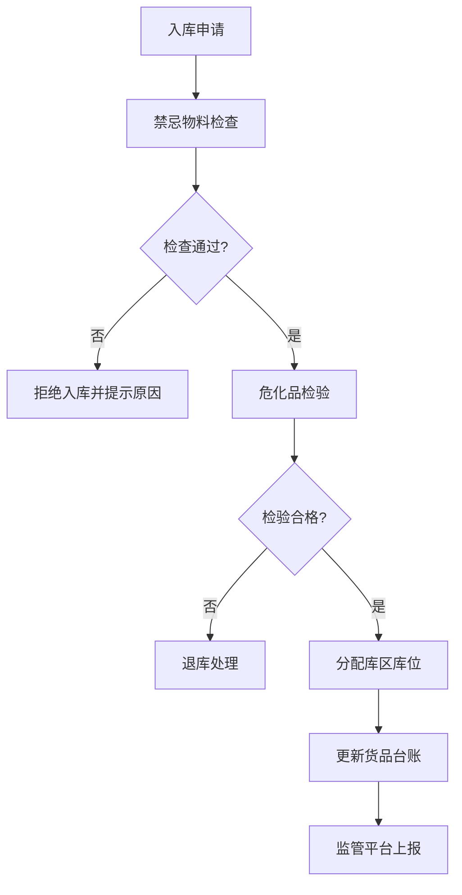

## 1. 产品概述

港口危化品仓储管理Web系统是一个面向港口危险化学品仓储企业的综合管理平台。系统覆盖危化品从入库、储存到出库的全生命周期管理，同时提供安全监控、应急处置和监管对接等核心功能，确保危化品仓储作业的安全、规范和高效。

- 主要解决危化品仓储过程中的信息不透明、安全监控缺失、应急响应迟缓、监管上报繁琐等问题
- 目标用户为港口危化品仓库管理人员、安全监管人员、应急处置人员及相关主管部门
- 产品价值在于提升危化品仓储管理的智能化水平，降低安全风险，提高监管效率

## 2. 核心功能

### 2.1 用户角色

| 角色 | 注册方式 | 核心权限 |
|------|---------|----------|
| 仓库管理员 | 系统分配 | 货品台账管理、入库登记、出库审批、库区管理 |
| 安全监管员 | 系统分配 | 安全监控、消防检查、人员资质审核、预警处置 |
| 应急处置员 | 系统分配 | 应急预案查看、事故上报、处置记录 |
| 系统管理员 | 系统分配 | 用户管理、权限配置、系统设置、监管对接 |

### 2.2 功能模块

1. **货品台账**：危化品基础信息管理、库存预警、危化品分类查询
2. **入库管理**：入库验收登记、危化品检验、入库单管理、禁忌物料检查
3. **库区储存**：分类分区储存、库区可视化、库位管理、温湿度监控
4. **出库配送**：出库申请、配送调度、出库单打印、车辆管理
5. **安全监控**：温湿度实时监控、可燃气检测、视频监控、人员资质管理、消防设施检查
6. **应急处置**：泄漏处置预案、火灾处置预案、应急资源、事故上报、处置记录
7. **监管对接**：监管平台上报、数据统计报表、合规检查、上报历史

### 2.3 页面详情

| 页面名称 | 模块名称 | 功能描述 |
|----------|---------|----------|
| 货品台账 | 危化品基础信息 | 危化品名称、CAS号、UN编号、危险性分类、MSDS信息维护 |
| 货品台账 | 库存预警 | 库存上下限设置、超储预警、缺货预警、有效期预警 |
| 货品台账 | 危化品分类查询 | 按危险性、储存类别、闪点等多维度查询筛选 |
| 入库管理 | 入库验收登记 | 入库单创建、供应商信息、货品信息、数量、批次登记 |
| 入库管理 | 危化品检验 | 外观检查、标签验证、安全数据单核对、检验结果记录 |
| 入库管理 | 禁忌物料检查 | 自动检测禁忌物料同库风险、提示隔离要求 |
| 库区储存 | 分类分区储存 | 按爆炸品、气体、易燃液体等分区可视化展示 |
| 库区储存 | 库区可视化 | 库区平面图、库位占用状态、货品分布热力图 |
| 库区储存 | 温湿度监控 | 各库区实时温湿度、超标报警、历史曲线 |
| 出库配送 | 出库申请 | 申请单创建、货品明细、用途说明、审批流程 |
| 出库配送 | 配送调度 | 车辆调度、路线规划、驾驶员信息、押运员信息 |
| 安全监控 | 可燃气检测 | 各监测点实时浓度、报警阈值设置、报警记录 |
| 安全监控 | 视频监控 | 库区摄像头列表、实时画面预览、录像回放入口 |
| 安全监控 | 消防设施检查 | 灭火器、消火栓、喷淋系统检查记录、有效期提醒 |
| 安全监控 | 人员资质管理 | 作业人员证书、培训记录、资质有效期、到期提醒 |
| 应急处置 | 泄漏火灾应急 | 泄漏处置步骤、火灾扑救方案、疏散路线图 |
| 应急处置 | 应急资源 | 应急物资库存、救援设备、应急联系人、外部救援机构 |
| 应急处置 | 事故上报 | 事故基本信息、影响范围、已采取措施、上报时间 |
| 监管对接 | 监管平台上报 | 自动上报入库/出库/库存数据、上报状态追踪 |
| 监管对接 | 数据统计报表 | 出入库统计、库存分析、安全趋势、违规记录 |

## 3. 核心流程

### 3.1 入库管理流程
仓库管理员创建入库单→系统自动进行禁忌物料检查→安全监管员进行危化品检验→检验通过后分配库区库位→更新货品台账和库存→同步监管平台上报

### 3.2 出库管理流程
申请人提交出库申请→仓库管理员审核→安全监管员复核→生成出库单→配送调度→出库扫码确认→更新库存→同步监管平台

### 3.3 安全应急流程
传感器监测异常→系统触发报警→通知安全监管员→启动应急预案→应急处置员现场处置→记录处置过程→事故上报→生成处置报告

## 4. 用户界面设计

### 4.1 设计风格
- **主色调**：深蓝(#1e3a5f)作为主色，体现专业、可靠的工业系统风格
- **辅助色**：橙色(#f59e0b)用于预警，红色(#dc2626)用于危险报警，绿色(#16a34a)用于安全状态
- **中性色**：深灰(#1f2937)、中灰(#6b7280)、浅灰(#f3f4f6)用于文本和背景
- **按钮风格**：圆角4px，填充色按钮为主操作，描边按钮为次要操作，带hover状态变化
- **字体**：使用"PingFang SC"、"Microsoft YaHei"等中文无衬线字体，标题字号18-20px，正文14px
- **布局风格**：左侧固定导航栏+顶部状态栏+主内容区的典型后台管理系统布局
- **图标风格**：使用Lucide图标库，线性图标风格，统一尺寸

### 4.2 页面设计概述

| 页面名称 | 模块名称 | UI元素 |
|----------|---------|--------|
| 货品台账 | 基础信息列表 | 数据表格、筛选器、分页、搜索框、统计卡片 |
| 货品台账 | 库存预警 | 预警卡片、预警等级标签、预警统计、处理按钮 |
| 入库管理 | 入库登记 | 表单布局、分步向导、文件上传、校验提示 |
| 入库管理 | 入库记录 | 时间线展示、状态标签、操作按钮组 |
| 库区储存 | 库区可视化 | 平面图、热力色块、库位Tooltip、图例 |
| 库区储存 | 温湿度监控 | 实时仪表、趋势折线图、报警指示灯 |
| 出库配送 | 出库单管理 | 卡片列表、状态流转、打印预览、二维码 |
| 安全监控 | 可燃气检测 | 仪表盘、实时数值、阈值线、报警闪烁动画 |
| 安全监控 | 视频监控 | 视频网格布局、在线状态指示灯、全屏按钮 |
| 安全监控 | 消防设施 | 设施卡片网格、检查状态、有效期进度条 |
| 应急处置 | 应急预案 | 步骤卡片、流程图解、紧急联系电话高亮 |
| 应急处置 | 事故上报 | 紧急红色主题表单、优先级选择、位置地图 |
| 监管对接 | 数据上报 | 上报进度条、成功/失败状态、重试按钮 |
| 监管对接 | 统计报表 | 柱状图、饼图、折线图、数据导出按钮 |

### 4.3 响应式设计
- 桌面优先设计，支持1366px及以上分辨率
- 左侧导航在平板尺寸自动收起为图标模式
- 数据表格在小屏幕转为卡片式展示
- 保持触控友好的点击区域（最小44x44px）
