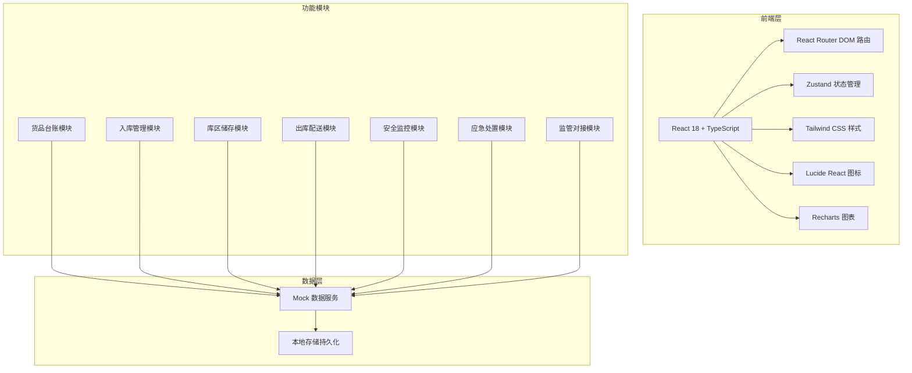
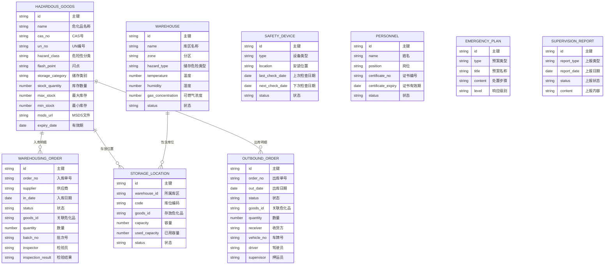

## 1. 架构设计

## 2. 技术说明

- **前端框架**：React 18 + TypeScript，采用函数式组件和Hooks
- **构建工具**：Vite 5，提供快速的开发体验和构建效率
- **路由管理**：React Router DOM 6，实现7个页面的路由导航
- **状态管理**：Zustand，轻量级状态管理，管理全局状态和业务数据
- **样式方案**：Tailwind CSS 3，原子化CSS，快速构建UI
- **图标库**：Lucide React，提供统一风格的线性图标
- **图表库**：Recharts，React生态的图表组件库，用于数据可视化
- **数据方案**：前端Mock数据，模拟真实业务数据，无需后端服务

## 3. 路由定义

| 路由路径 | 页面用途 |
|---------|---------|
| /inventory | 货品台账 - 危化品基础信息管理和库存预警 |
| /warehousing | 入库管理 - 入库验收登记和危化品检验 |
| /storage | 库区储存 - 分类分区储存可视化和温湿度监控 |
| /outbound | 出库配送 - 出库申请和配送调度 |
| /safety | 安全监控 - 温湿度、可燃气、视频监控和消防检查 |
| /emergency | 应急处置 - 泄漏火灾应急和事故上报 |
| /supervision | 监管对接 - 监管平台上报和数据统计 |

## 4. 数据模型

### 4.1 数据模型定义

### 4.2 禁忌物料规则
- 爆炸品不得与任何其他危化品同库存放
- 氧化性物质不得与易燃液体、易燃固体同库存放
- 酸性腐蚀品不得与碱性腐蚀品同库存放
- 有毒物质不得与食品级物质同库存放
- 闪点低于28℃的易燃液体需专库存放
